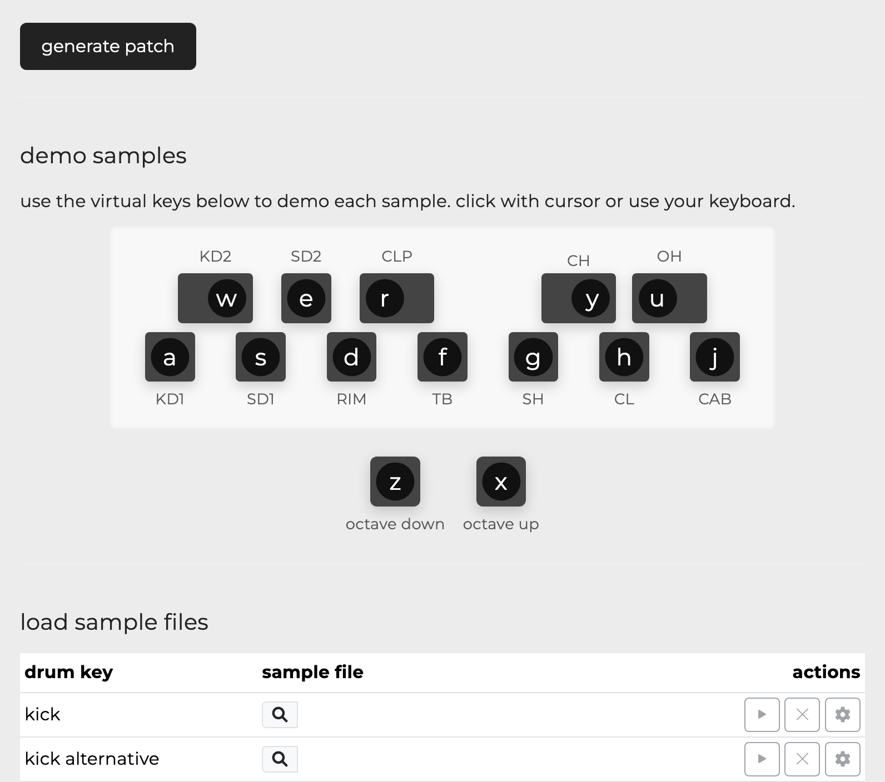

# OP-PatchStudio

web-based tools for creating custom drum and multisample presets for the teenage engineering OP-XY.



- **live demo:** [OP-PatchStudio](https://opxy-tools.pages.dev/)
- **GitHub:** [github.com/joseph-holland/opxy-tools](https://github.com/joseph-holland/opxy-tools)

## features

- preset generation for OP-XY (zip file export)
- modern, responsive ui built with React and Carbon Design System
- drag-and-drop sample assignment for drum and multisample presets
- re-encode samples to 44, 22 or 11khz
- advanced preset settings (envelopes, tuning, velocity, etc.)
- waveform and marker editing for samples with snap to zero point crossing functionality

## development setup

This project has been migrated to React with TypeScript for improved maintainability and modularity.

### requirements

- Node.js 16+ 
- npm or yarn

### installation

```bash
# Clone the repository
git clone https://github.com/joseph-holland/opxy-tools.git
cd op-patchstudio

# Install dependencies
npm install

# Start development server
npm run dev

# Build for production
npm run build
```

### project structure

```
/src
  /components         # React UI components (Carbon-based, OP-XY themed)
    /common          # Shared components
    /drum           # Drum-specific components
    /multisample    # Multisample-specific components
  /hooks              # Custom hooks for state, file I/O, audio, etc.
  /utils              # Pure JS/TS logic: audio, patch, file mgmt
  /theme              # Custom Carbon theme and style overrides
  /context            # App/global context providers
  App.tsx
  main.tsx
```

## usage

1. open the [OP-PatchStudio web app](https://opxy-tools.pages.dev/) in your browser.
2. select either the **drum** or **multisample** tab.
3. drag and drop your samples, or use the browse button to select files.
4. assign notes (for multisample), adjust settings and use the advanced dialog for detailed control.
5. optionally, use **import settings** to load engine-level settings from existing preset files.
6. click **generate patch** to download your preset as a zip file.
7. unzip and copy the folder to your OP-XY's `presets` directory via usb.

## migration status: **70-75% complete** 🚀

This project has been successfully migrated from vanilla HTML/JS to React with TypeScript and Carbon Design System. Recent major improvements include advanced audio processing, interactive waveform editing, and real-time patch size monitoring.

### completed ✅
- **Core Infrastructure**: AudioContext management, enhanced state management
- **Advanced Audio Processing**: WAV metadata parsing, format conversion, zero-crossing detection
- **Interactive Waveform Editor**: Canvas-based rendering with draggable markers
- **Real-time Patch Size Monitoring**: Live calculation with optimization recommendations
- **Enhanced UI Components**: PatchSizeIndicator, WaveformEditor, improved drum grid
- **Memory Management**: Singleton AudioContext pattern prevents memory leaks
- **Type Safety**: Comprehensive TypeScript coverage with proper error handling
- **File Upload System**: Enhanced with metadata extraction and validation

### in progress 🚧
- Advanced sample controls (gain, pan, tune sliders)
- Recording functionality with WebRTC
- Enhanced multisample tool features
- Session management (import/export settings)
- Comprehensive test suite

### recent improvements 🎉
- **Mini Waveform Previews**: Each drum pad now shows a waveform with trimming controls
- **Audio Format Controls**: Sample rate, bit depth, and channel selection
- **Smart Note Detection**: Automatic MIDI note extraction from WAV metadata and filenames
- **Performance Optimizations**: Efficient audio buffer operations and real-time calculations

See [MIGRATION_COMPLETION_SUMMARY.md](MIGRATION_COMPLETION_SUMMARY.md) for detailed progress report.

## credits

- originally created by [zeitgeese](https://github.com/buba447)
- forked from [buba447/opxy-drum-tool](https://buba447.github.io/opxy-drum-tool/)

OP-XY is a trademark of teenage engineering. this is an unofficial tool and is not affiliated with or endorsed by teenage engineering.
